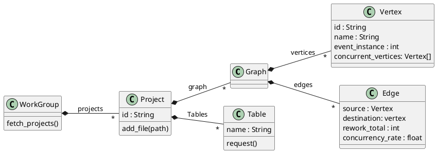

```puml
@startuml
left to right direction

class Graph{}

class Vertex{
    id : String
    name : String
    event_instance : int
    concurrent_vertices: Vertex[]
}
class Edge{
    source : Vertex
    destination: vertex
    rework_total : int
    concurrency_rate : float
}

class WorkGroup{
    fetch_projects()
}

class Project{
    id : String
    add_file(path)
}

class Table{
    name : String
    request()
}

Project *-- "*" Graph : graph
Project *-- "*" Table : Tables
Graph *-- "*" Vertex : vertices
Graph *-- "*" Edge : edges
WorkGroup *-- "*" Project : projects

@enduml
```
