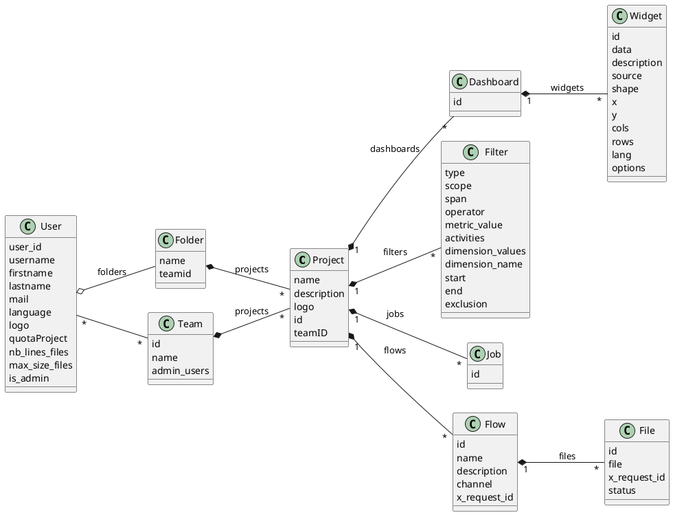

```puml
@startuml
left to right direction

class Project{
name
description
logo
id
teamID
}

class Dashboard{
id
}

class Widget{
id
data
description
source
shape
x
y
cols
rows
lang
options
}

class User{
user_id
username
firstname
lastname
mail
language
logo
quotaProject
nb_lines_files
max_size_files
is_admin
}

class Folder{
name
teamid
}

class Team{
id
name
admin_users
}

class Filter{
type
scope
span
operator
metric_value
activities
dimension_values
dimension_name
start
end
exclusion
}

class Job{
id
}

class Flow{
id
name
description
channel
x_request_id
}

class File{
id
file
x_request_id
status
}

Folder *-- "*" Project : "projects"
Team *-- "*" Project : "projects"
Project "1" *-- "*" Dashboard : "dashboards"
Project "1" *-- "*" Filter : "filters"
Project "1" *-- "*" Job : "jobs"
Project "1" *-- "*" Flow : "flows"
Flow "1" *-- "*" File : "files"
Dashboard "1" *-- "*" Widget : "widgets"
User o-- Folder : "folders"
User "*" -- "*" Team
@enduml
```
