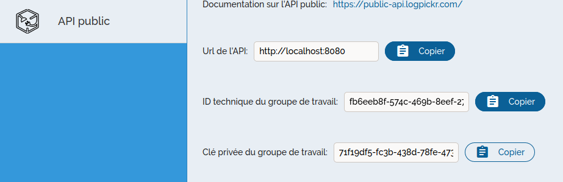

How to use the SDK
==================

.. _here : https://gitlab.com/igrafx/logpickr/logpickr-sdk
.. _f-strings : https://realpython.com/python-f-strings/
.. _Dataframe : https://pandas.pydata.org/pandas-docs/stable/reference/api/pandas.DataFrame.html
.. _Python Database API : https://www.python.org/dev/peps/pep-0249/

Installing
----------

.. role:: bash(code)
   :language: bash

First, install the SDK. If we've published it, then you can simply install it with :bash:`pip install logpickr_sdk`. If not, then install from source or download the wheel and install that.

From source:
++++++++++++

The source code for the SDK can be found `_here` _. Once installed, go to `logpickr_sdk` and run :bash:`pip install .`. Dependencies should be automatically installed along with it. Before installing, you can run the tests.

From wheel:
+++++++++++

First, download the latest version of the wheel :download:`here <_static/logpickr_sdk.whl>`. Then, navigate to your download folder and run :bash:`pip install logpickr_sdk.whl`.

Getting Started
-------------------------

First, open up Process Explorer 360, and go to your workgroup settings. In the settings page, go to the **Public API** tab. There you should see your workgroup's ID and and secret key. These are the values that will be used by the SDK to log in to the Logpickr API.
    

   
   
To begin, go ahead and import the package::

    >>> import logpickr_sdk as lpk   # the 'as lpk' is entirely optional, but it will make the rest of our code much more readable

Workgroups and Projects
-----------------------

The first step of using the Logpickr SDK will be to create a workgroup, using the credentials you copied from Process Explorer 360::

    >>> w_id = "<YOUR WORKGROUP ID>"
    >>> w_key = "<YOUR WORKGROUP KEY>"
    >>> api_url = "https://dev-api.logpickr.com"
    >>> auth_url = "https://dev-auth.logpickr.com"
    >>> wg = lpk.Workgroup(w_id, w_key, api_url, auth_url)

Once the workgroup is created, you can access the list of projects assosciated with the workgroup through the projects property::
    
    project_list = wg.projects
    
Alternatively, if you already know the ID of the project you want to work with you can use::

    >>> my_project = wg.project_from_id(16)

.. _here : https://gitlab.com/logpickr/logpickr-sdk

Once you have the project you want to use, you can access its components: the model graph, the graph instances, and the datasources.

The model graph is (simply enough) accessed through the "graph" function::

    >>> my_project = wg.project_from_id(9)
    >>> g = my_project.graph()
    >>> g.display()
    
The `.display()` method uses graphviz to render the graph in svg format and displays it. It works on both Graph and GraphInstance objects. Additionally, when calling a graph, you can pass a :bash:`True` or :bash:`gateways=True` argument to get the graph in a bpmn-like structure ::

    >>> my_project = wg.project_from_id(32)
    >>> g = my_project.graph(True)
    >>> g.display()

The graph instances are accessible as a list, or you can request one directly by using one of the project's process keys::

    >>> my_project = wg.project_from_id(9)
    >>> graph_instance_list = my_project.graph_instances
    >>> pk = my_project.process_keys[0]
    >>> gi = my_project.graph_instance_from_key(pk)
    >>> gi.display
    
Each projects is also linked to datasources, which can be accessed with::

    >>> dblist = my_project.datasources
    
Each database can be queried with SQL requests. In those requests, the name of the table is accessible through the `name` attribute, and must be in between double quotes. The use of `f-strings`_ is highly recommended::

    >>> ds = my_project.datasources[0]
    >>> tab = ds.request(f"SELECT * FROM \"{ds.name}\" WHERE processkey = 4a25cd89fdd4a5e6")
    
The `request()` method returns a pandas `DataFrame`_, which can be easily converted into your data structure of choice. If you want to see the structure of the datasource, you can use the `columns` property::

    >>> ds = my_project.datasources[0]
    >>> print(ds.columns)
    
Alternatively, if need be, you can directly use the datasource's `connection` and `cursor` properties, which can be used as specified in the `Python Database API`_ ::

    >>> ds = my_project.datasources[0]
    >>> ds.connection
    >>> ds.cursor

Once you have your project, you can make it train and run predictions on it. For the training, the project has the :bash:`launch_train()` and :bash:`stop_train()` methods, as well as a :bash:`train_status` property, which can be used like so::
    >>> my_project = wg.project_from_id(42)
    >>> my_project.train_status
    False
    >>> my_project.lauch_train()
    >>>my_project.train_status
    True
    >>> my_project.stop_train()
    >>> my_project.train_status
    False

Once the train is complete, you can run predictions on the case IDs you want in your project::
    >>> my_project = wg.project_from_id(17)
    >>> my_project.train_status # we can make sure the training is finished
    False
    >>> case_list = ["1235acd", "6568bbn", "9124kxc"]
    >>> prediction_data = my_project.prediction(case_list)
