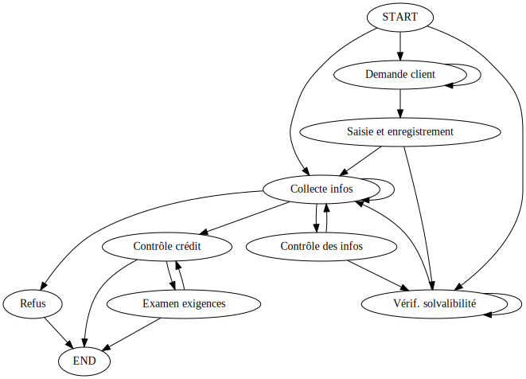
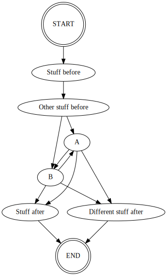
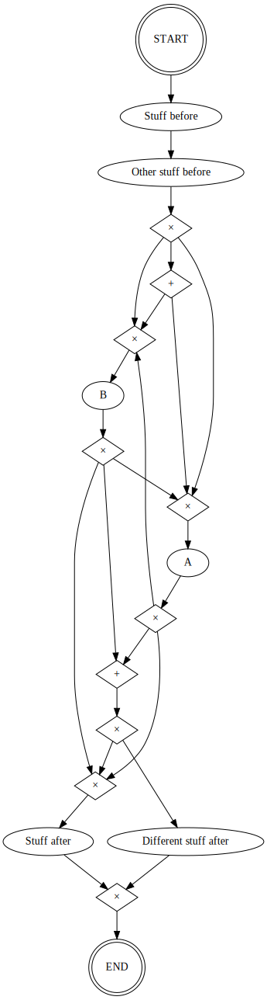
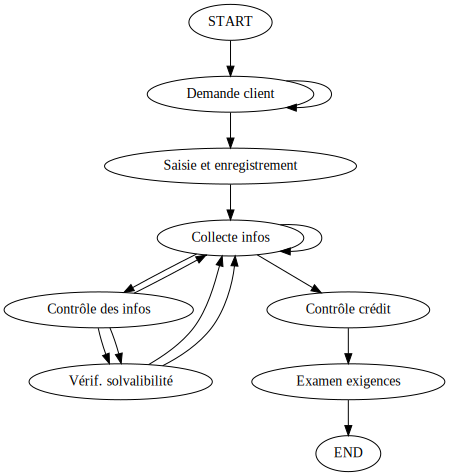

.. py:currentmodule:: logpickr_sdk

.. role:: bash(code)
   :language: bash

Graphs and Graph Instances
==========================

Difference between Graphs and GraphInstances:
---------------------------------------------

Each `project`_ has a single model graph, which is sometimes referred to as the model. This graph represents the whole of the organization whose processes you're analyzing. Each node is an event, and every edge represents a possible transition between two events.

   
*The model graph represents all of the ways a bank loan application can be handled*

This model graph can be acessed in two formats: either in a basic format where the only vertices are tasks, or in a BMPN-like structure with AND and XOR gateways to better illustrate the process flow. This second model can be accessed by passing a :bash:`gateways=True` parameter to the graph function.

   
*The model graph in its basic format*

   
*The model graph in its BPMN-like format*
   
Each GraphInstance, in turn, represents the path through the model_ taken by a single process. Each project_ has a list of processes, and for every proccess there exists a graph instance. Similarly to the model graphs, the edges represent the path taken by the process through the possible events.

   
*The process graph represents how one specific process (one client here) went through the loan application process*

Graphs
------

.. autoclass:: Graph
   :special-members: __init__
   :members:
   
.. autoclass:: Edge
   :special-members: __init__
   :members:
   
.. autoclass:: Vertex
   :special-members: __init__
   :members:
   
Graph Instances
---------------

**Note: GraphInstance and VertexInstance extend Graph and Vertex respectively**

.. autoclass:: GraphInstance
   :members:
   
.. autoclass:: EdgeInstance
   :members:
   
.. autoclass:: VertexInstance
   :members:

.. _project : workgroup.html#Projects
.. _model : Graphs
